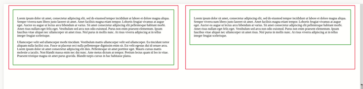
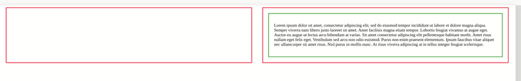
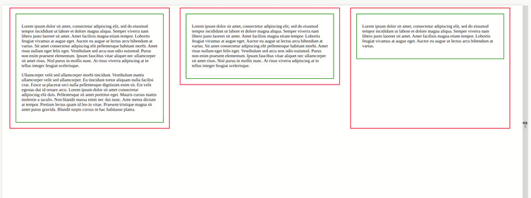

# React Equal Height
Comparing elements on react state and hooks by name and set max height.

## Installation
```
npm i react-equal-height
```

## Usage
```tsx
import { EqualHeight, EqualHeightElement } from 'react-equal-height';

<EqualHeight>
    <EqualHeightElement name="Name">
        <p>
            Lorem ipsum dolor sit amet, consectetur adipiscing elit. Proin nibh augue, suscipit a, scelerisque sed, lacinia in, mi. Cras vel lorem.
        </p>
    </EqualHeightElement>
    <EqualHeightElement name="Name">
        <p>
            Lorem ipsum dolor sit amet, consectetur adipiscing elit. Proin nibh augue, suscipit a, scelerisque sed, lacinia in, mi. Cras vel lorem.
        </p>
        <p>
            tiam pellentesque aliquet tellus. Phasellus pharetra nulla ac diam. Quisque semper justo at risus. Donec venenatis, turpis vel hendrerit interdum, dui ligula ultricies purus, sed posuere libero dui id orci.
        </p>
    </EqualHeightElement>
</EqualHeight>
```
* **EqualHeight** - all elements for which height will be calculating must be included in this element
* **EqualHeightElement** - element for which will be calculating height
* **EqualHeightContext** - lib context

## Options (EqualHeight)
| Prop          | Default   | Required  | Description                                           |
|---------------|:---------:|:---------:|:------------------------------------------------------|
| ```timeout``` | **200**   | **false** | delay for recalculate height when window is resizing  |
| ```animate``` | **false** | **false** | animation for changing height                         |

## Options (EqualHeightElement)
| Prop              | Default   | Required  | Description                                                       |
|------------------ |:---------:|:---------:|:------------------------------------------------------------------|
| ```name```        |           | **true**  | all heights of elements with the same name are comparing          |
| ```placeholder``` | **false** | **false** | to keeping height in place where element not exist                |
| ```disable```     | **false** | **false** | is disabling ```EqualHeightElement``` (children are still passing)|
| ```overflow```    | **true**  | **false** | adding ```overflow: hidden``` on element                          |

## Methods (EqualHeightContext)
`forceUpdateSize, setForceUpdateSize` - 
force to recalculate heights for components

_Example of usage (elements with image)_
```tsx
import { EqualHeight, EqualHeightContext, EqualHeightElement } from 'react-equal-height';

const { forceUpdateSize, setForceUpdateSize } = useContext(EqualHeightContext);

const handleImageLoaded = (): void => {
    setForceUpdateSize(!forceUpdateSize);
};

<EqualHeight>
    <EqualHeightElement name="Name">
        
        <p>
            Lorem ipsum dolor sit amet, consectetur adipiscing elit. Proin nibh augue, suscipit a, scelerisque sed, lacinia in, mi. Cras vel lorem.
        </p>
    </EqualHeightElement>
    <EqualHeightElement name="Name">
        <p>
            Lorem ipsum dolor sit amet, consectetur adipiscing elit. Proin nibh augue, suscipit a, scelerisque sed, lacinia in, mi. Cras vel lorem.
        </p>
        <p>
            tiam pellentesque aliquet tellus. Phasellus pharetra nulla ac diam. Quisque semper justo at risus. Donec venenatis, turpis vel hendrerit interdum, dui ligula ultricies purus, sed posuere libero dui id orci.
        </p>
    </EqualHeightElement>
</EqualHeight>
```

# Image examples
Base 



Placeholder



Disable


